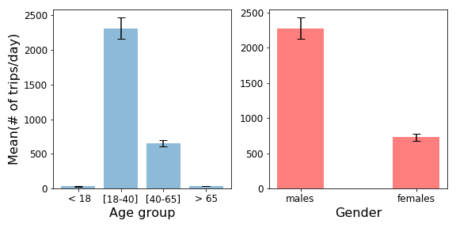

# Bike-Sharing
## Introduction:

Transportation congestion and air pollution are two major problems in most large cities. Using bikes instead of personal vehicles can be a practical solution to address these critical issues. As such, governments all around the world support companies that facilitate using bikes. Bike sharing system is a trending industry to encourage citizens to use bikes as their daily transportation mode. 

Successful adopting this technology highly depends on user experience (UX) and implementing appropriate policies. Monitoring bike systems enables us to make appropriate decisions to improve UX and corresponding policies. As such, in this study, I aim to explore data for a bike sharing system.

In terms of UX, it is essential to explore the daily and seasonal usage of bikes to make sure that there are sufficient bikes based on demands. In addition, understanding whether this technology is adopted for daily usage, it is important to explore bike usages in different weekdays. As such, the main goal of this study is to visualize and compare time usage of bikes for different seasons, weekdays, and day times.

## Methods:

To achieve the main goal of this study, I used three different datasets. The first dataset was for a bake share system( i.e., Bluebikes in Boston) [1]. Here, I only included data for year 2017. This dataset included more than 1,300,000 instances with the following attributes [2]:

	1. Trip Duration (seconds)
	2. Start Time and Date
	3. Stop Time and Date
	4. Start Station Name & ID
	5. End Station Name & ID
	6. Bike ID
	7. User Type (Casual = Single Trip or Day Pass user; Member = Annual or Monthly Member)
	8. Birth Year
	9. Gender

The second dataset [3] included Boston weather data for every days between 1/1/2013-4/8/18. Again, I only used dataset for year 2017. This dataset contains the following attributes:

	1. Averages of temperature
	2. Average of dew point
	3. Average of wind speeds
	4. sea level pressure
	5. precipitation levels

Finally, the last dataset [3] included 2017 official holidays for Boston.

To analyze data, I first had to join all of the data tables (i.e., biking system dataset, weather dataset, and holidays information). For this purpose, I first created three columns (i.e., year, month, and day) based on the “starttime” column data. I used these new columns as primary keys to merge the biking system dataset with the weather data table which had the same columns. Before merging the holiday data table to other datasets, I reshaped it to include the following columns: year, month, and day. By using these columns, I joined all of the three data tables. I also created ‘age’ and ‘season’ columns based on ‘birth year’ and ‘month’ column respectively. 

In this project, I was mainly interested in exploring the effects of different factors on the number of trips/day. To compute my main outcomes (# trips/day), I counted the number of the “starttime” for each day. To achieve the main goal of this study, I explored the effects of weather condition, season, gender, and age on the main outcome by visualizing several patterns and testing the following hypotheses:

	H1. Number of trips/day depends of weather conditions.
	H2. Number of trips/day is highly correlated with weather indexes (e.g., Avg temp, Avg Humidity, Avg Visibility, Avg Wind speed). 
	H3. Number of trips/day is higher during the warm seasons comparing with the cold seasons.
	H4. Number of registered users higher than casual users during weekdays.
	H3. Number of casual users are higher than registered users during off days.
	H4. Number of trips/day is higher during each weekday comparing to weekends.
	H5. Number of trips/day for females and males are similar.
	H6. Number of trips/day for young people are higher than other age groups.

In the following sections, I discussed the results of my analyses in details.

## The effects of weather on number of trips/day

### Weather indexes and the number of trips per day

I first explored whether there were any correlations between the number of trips and weather indexes. I found that the average temperatures and the number of trips for each day are highly correlated (Table 1 and Fig1). Though the number of trips and other indexes were not highly corelated, the effects of some these indexes on the output were significant. For example, the correlation between average wind speed and the outcome were significant (p-value <0.001).    

Table 1. Correlation between different weather indexes and the number of trips/day 

|       index       |Avg Temp (F)|Avg Humidity (%)|Avg Visibility (mi)|Avg Wind (mph)|Number of trips/day|
|-------------------|-----------:|---------------:|------------------:|-------------:|--------------:|
|Avg Temp (F)       |       1.000|           0.173|              0.130|        -0.226|          0.844|
|Avg Humidity (%)   |       0.173|           1.000|             -0.619|        -0.134|          0.000|
|Avg Visibility (mi)|       0.130|          -0.619|              1.000|        -0.102|          0.296|
|Avg Wind (mph)     |      -0.226|          -0.134|             -0.102|         1.000|         -0.319|
|Total_count_day    |       0.844|           0.000|              0.296|        -0.319|          1.000|

Fig 1. The correlation between different weather indexes and the outcome variables. </em>

### Weather conditions:

Here, I compared the number of trips/day for different weather conditions (i.e., clear, rainy, snowy, and both rainy and snowy weathers). Analyses of variance (ANOVAs) showed that the weather condition had significant effects on the outcome (p<0.001). I used the Tukey method for performing the paired comparisons. This method showed that the number of trips were significantly higher during clear and rainy weathers comparing with the snowy and both snowy and rainy weathers (Table2 and Fig 2). Surprisingly, there were not any significant differences between rainy and clear weather.

Table 2. results of multiple comparison of means - Tukey HSD

|group1|group2|p-adj|reject|
|------|------|----:|------|
|Both  |None  |0.001|True  |
|Both  |Rain  |0.001|True  |
|Both  |Snow  |0.900|False |
|None  |Rain  |0.653|False |
|None  |Snow  |0.001|True  |
|Rain  |Snow  |0.001|True  |

Fig 2. It shows the mean of the number of trips/day for different weather conditions. Error bars indicate 95% confidence intervals. </em>

### Season effects

My results showed that seasons had significant effects on the outcome variable (Table 3). As you can see in Fig 3, the number of trips/day increased significantly during spring and summer comparing with winter and fall. It is also interesting that the difference between fall and winter is very large (Fig 3).

Table 3. results of multiple comparison of means - Tukey HSD

|group1|group2|p-adj|reject|
|-----:|-----:|----:|------|
|Winter|Spring|0.001|True  |
|Winter|Summer|0.001|True  |
|Winter|  Fall|0.001|True  |
|Spring|Summer|0.001|True  |
|Spring|Winter|0.002|True  |
|Summer|Winter|0.001|True  |

Fig 3. It shows the mean of the number of trips/day for different seasons. Error bars indicate 95% confidence intervals. </em>

## Registered users vs casual users

In this section, I investigated how the number of trips/day look like for different users (i.e., registered and casual users). As you can see in Fig 4., the causal users (indicated by red markers) mainly started their trips from stations that were closer to recreational areas. Based on the marker sizes in Fig 4, the majority of trips started by the registered users, and these users are distributed in larger area in Boston.

Fig 4. It shows start locations and number of trips/day for all of the biking trips in year 2017. The blue markers indicate registered customers and red markers show casual users. The markers sizes are proportional to the number of trips per day. </em>

Based on Fig.5, in all days of the year 2017, the registered users were higher than casual users. Also, it seems that the pick of bike usages for registered and casual users did not occur at the same time. The pick of usages for the registered users was around September, and for the causal users occurred around June. 

Fig 5. It shows the number of trips/day over time for different users. Error bars indicate 95% confidence intervals. </em>

### Usage patterns of users for Weekdays vs Weekend

I investigated the usage patterns of different users for weekdays and weekend. T-test analyses showed that the number of trips/day for registered users are significantly (p-value < 0.001) higher than casual users for both weekdays and weekend. It is also worth noting that the number of trips of registered users decreased from weekdays to weekend (Fig 6). This pattern is opposite for casual users.

Fig 6. It shows the mean of the number of trips/day of different users for weekdays vs weekend. </em>

## Age and gender effects

ANOVA analysis revealed that age had significant effects on the number of trips/day (p-value < 0.001). Young people ( 18< age <40 ) had the highest number of trips/day among all of the age groups (Fig. 7, left). Though, the number of trips/day for middle age group (40 < age <65) were significantly lower than the young group (Table 4, Fig. 7), bike usages of this group was still noticeable comparing to the elderly and individuals younger than 18 years old. In addition, t-test analysis indicated that males had significantly higher (p-value < 0.001) number of trips/day comparing to females (Fig. 7, right).

Table 4. results of multiple comparison of means - Tukey HSD
|group1 |group2 |p-adj|reject|
|-------|-------|----:|------|
|< 18   |[18-40]|0.001|True  |
|< 18   |[40-65]|0.001|True  |
|< 18   |[> 65] |0.900|False |
|[18-40]|[40-65]|0.001|True  |
|[18-40]|[>65]  |0.001|True  |
|[40-65]|>65    |0.001|True  |

Fig 7. It shows the mean of the number of trips/day for different age groups (left) and gender (right). Error bars indicate 95% confidence intervals.  </em>

## Discussion and Conclusion

In this study, I explored the effects of different factors (i.e., weather, customer types, age, and gender) on the number of trips/day. In general, the results support my hypotheses. 
As I expected, the number of trips increased by improving weather conditions. It is worth noting that, rainy weather did not have significant effects on the outcome variable (Table 2 and Fig.2). Also, the number of trips were significantly lower than other seasons. These results together imply that road conditions play a key role for the users to decide whether they should use bikes or other types of transportations. Therefore, it is essential to include data related to road conditions to have a better understanding about the bike system data.

Exploring data related to type of customers showed that the casual users mainly used bikes in areas that were closer to the creational centers (Fig. 4). However, the registered users started their trips from more diverse areas in Boston. It is also worth noting that the casual users started their trips during summer more often (Fig. 5). However, the pike of usages for the registered users were around September. Finally, while the number of trips of registered users were lower during weekend, the casual users started more trips during weekend (Fig. 6). All of these results together suggest that the registers users use bikes as a transportation method, but casual users mainly use bikes for fun. As such, to make appropriate transportation policies, we should mainly consider data related to the registered users. 

The gender and age analyses showed that we should adopt new policies to encourage the middle age group and females to use bike more. While the number of trips for these groups (females and middle age group) are noticeable (Fig. 7), they do not use bike as much as other groups (males and young people). As such, we should provide appropriate incentives for females and middle age group to make sure that they will use bikes for transportation more.

## References:

1. https://s3.amazonaws.com/hubway-data/index.html
2. https://www.bluebikes.com/system-data
2. https://www.kaggle.com/jqpeng/boston-weather-data-jan-2013-apr-2018
3. https://www.officeholidays.com/countries/usa/massachusetts/2017
